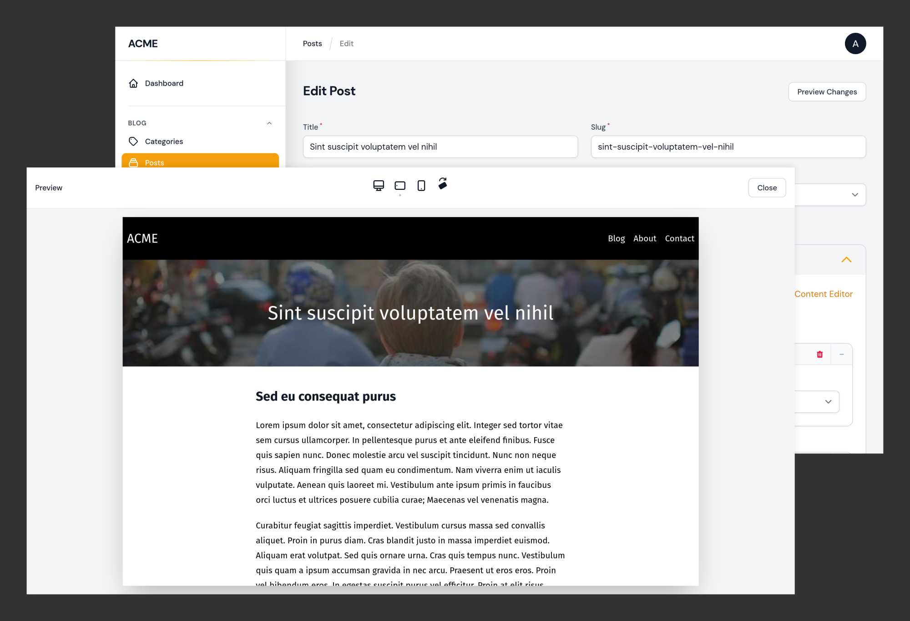

# Peek

<p>
<a href="https://github.com/pboivin/filament-peek/actions"></a>
<a href="https://packagist.org/packages/pboivin/filament-peek"></a>
<a href="https://packagist.org/packages/pboivin/filament-peek"></a>
<a href="https://packagist.org/packages/pboivin/filament-peek"></a>
</p>

A Filament plugin to add a full-screen preview modal to your Edit pages. The modal can be used before saving to preview a modified record.



## Installation

You can install the package via composer:

```bash
composer require pboivin/filament-peek:"^1.0"
```

#### Compatibility

| Peek | Status | Filament | PHP |
|------|----------|-----|--------|
| [1.x](https://github.com/pboivin/filament-peek/tree/1.x) | Bugfixes only | ^2.0 | ^8.0 |
| [2.x](https://github.com/pboivin/filament-peek/tree/2.x) | Current version | ^3.0 | ^8.1 |

#### Demo Project

For an easy way to try out the plugin on a simple Filament project, have a look at the [filament-peek-demo](https://github.com/pboivin/filament-peek-demo/tree/1.x) repository.

## Documentation

The documentation is available in the `docs/` directory:

<!-- BEGIN_TOC -->

- [Configuration](./docs/configuration.md)
    - [Publishing the Config File](./docs/configuration.md#publishing-the-config-file)
    - [Available Options](./docs/configuration.md#available-options)
- [Page Previews](./docs/page-previews.md)
    - [Overview](./docs/page-previews.md#overview)
    - [Using the Preview Modal with Blade Views](./docs/page-previews.md#using-the-preview-modal-with-blade-views)
    - [Detecting the Preview Modal](./docs/page-previews.md#detecting-the-preview-modal)
    - [Adding Extra Data to Previews](./docs/page-previews.md#adding-extra-data-to-previews)
    - [Alternate Templating Engines](./docs/page-previews.md#alternate-templating-engines)
    - [Using a Preview URL](./docs/page-previews.md#using-a-preview-url)
    - [Embedding a Preview Link into the Form](./docs/page-previews.md#embedding-a-preview-link-into-the-form)
    - [Preview Pointer Events](./docs/page-previews.md#preview-pointer-events)
- [Builder Previews](./docs/builder-previews.md)
    - [Overview](./docs/builder-previews.md#overview)
    - [Using the Builder Preview with Blade Views](./docs/builder-previews.md#using-the-builder-preview-with-blade-views)
    - [Using Multiple Builder Fields](./docs/builder-previews.md#using-multiple-builder-fields)
    - [Using Custom Fields](./docs/builder-previews.md#using-custom-fields)
    - [Adding Extra Data to the Builder Editor State](./docs/builder-previews.md#adding-extra-data-to-the-builder-editor-state)
    - [Adding Extra Data to the Builder Preview](./docs/builder-previews.md#adding-extra-data-to-the-builder-preview)
    - [Alternate Templating Engines](./docs/builder-previews.md#alternate-templating-engines)
    - [Customizing the Preview Link](./docs/builder-previews.md#customizing-the-preview-link)
    - [Automatically Updating the Builder Preview](./docs/builder-previews.md#automatically-updating-the-builder-preview)
- [JavaScript Hooks](./docs/javascript-hooks.md)

<!-- END_TOC -->

## Testing

```bash
composer test
```

## Changelog

Please see [CHANGELOG](CHANGELOG.md) for more information on what has changed recently.

## Contributing

Please see [CONTRIBUTING](.github/CONTRIBUTING.md) for details.

## Security Vulnerabilities

Please review [our security policy](../../security/policy) on how to report security vulnerabilities.

## Credits

- [Patrick Boivin](https://github.com/pboivin)
- [All Contributors](../../contributors)

## Acknowledgements

The initial idea is heavily inspired by module previews in [Twill CMS](https://twillcms.com/).

## License

The MIT License (MIT). Please see [License File](LICENSE.md) for more information.
