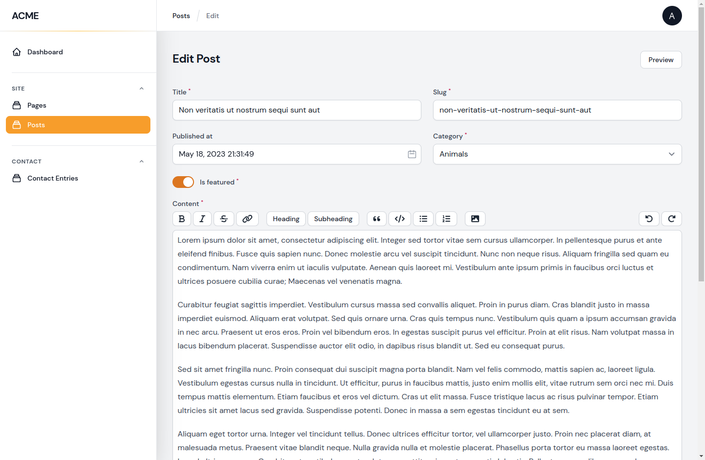
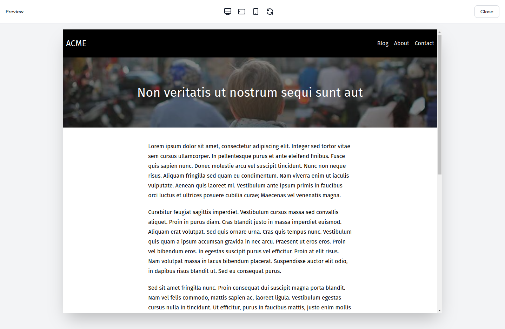

# Peek

<p>
<a href="https://github.com/pboivin/filament-peek/actions"></a>
<a href="https://packagist.org/packages/pboivin/filament-peek"></a>
<a href="https://packagist.org/packages/pboivin/filament-peek"></a>
</p>

<br>

A Filament plugin that adds a full-screen preview modal to your Edit pages. The modal can be used before save to preview a modified record.



---



## Installation

You can install the package via composer:

```bash
composer require pboivin/filament-peek
```

The requirements are **PHP 8.0** and **Filament 2.0**

## Configuration

You can publish the config file with:

```bash
php artisan vendor:publish --tag="filament-peek-config"
```

This is the contents of the published config file:

```php
return [

    /*
    |--------------------------------------------------------------------------
    | Device Presets
    |--------------------------------------------------------------------------
    |
    | Device presets allow users to quickly resize the preview iframe to
    | specific dimensions. Set this to `false` to deactivate device presets.
    |
    */

    'devicePresets' => [
        'fullscreen' => [
            'icon' => 'heroicon-o-desktop-computer',
            'width' => '100%',
            'height' => '100%',
            'canRotatePreset' => false,
        ],
        'tablet-landscape' => [
            'icon' => 'heroicon-o-device-tablet',
            'rotateIcon' => true,
            'width' => '1080px',
            'height' => '810px',
            'canRotatePreset' => true,
        ],
        'mobile' => [
            'icon' => 'heroicon-o-device-mobile',
            'width' => '375px',
            'height' => '667px',
            'canRotatePreset' => true,
        ],
    ],

    /*
    |--------------------------------------------------------------------------
    | Initial Device Preset
    |--------------------------------------------------------------------------
    |
    | The default device preset to be activated when the modal is open.
    |
    */

    'initialDevicePreset' => 'fullscreen',

    /*
    |--------------------------------------------------------------------------
    | Allow Iframe Overflow
    |--------------------------------------------------------------------------
    |
    | Set this to `true` if you want to allow the iframe dimensions to go beyond
    | the capacity of the available preview modal area.
    |
    */

    'allowIframeOverflow' => false,

];
```

## Basic Usage with Blade Views

In your `EditRecord` pages:

1. Add the `HasPreviewModal` trait.
2. Add the `PreviewAction` class to the returned array in `getActions()`.
3. Override the `getPreviewModalView()` method to define your Blade view.
4. If your view expects a `$page` variable, override the `getPreviewModalDataRecordKey()` method to define it. By default, this variable will be `$record`.

The modal can also be used on `CreateRecord` pages and, if needed, `ListRecords` pages.

#### Complete Example

`app/Filament/Resources/PageResource/Pages/EditPage.php`

```php
namespace App\Filament\Resources\PageResource\Pages;

use App\Filament\Resources\PageResource;
use Filament\Resources\Pages\EditRecord;
use Pboivin\FilamentPeek\Pages\Actions\PreviewAction;
use Pboivin\FilamentPeek\Pages\Concerns\HasPreviewModal;

class EditPage extends EditRecord
{
    use HasPreviewModal;

    protected static string $resource = PageResource::class;

    protected function getActions(): array
    {
        return [
            PreviewAction::make(),
        ];
    }

    protected function getPreviewModalView(): ?string
    {
        return 'pages.preview';
    }

    protected function getPreviewModalDataRecordKey(): ?string
    {
        return 'page';
    }
}
```

## Detecting the Preview Modal

If you're using the same Blade view for the site page and the preview modal, you can detect if the view is currently rendered in a preview modal by checking for the `$isPeekPreviewModal` variable:

`resources/views/pages/show.blade.php`

```blade
<x-layout>
    @isset($isPeekPreviewModal)
        <x-preview-banner />
    @endisset
    
    <x-container>
        ...
    </x-container>
</x-layout>
```

## Adding Extra Data to Previews

By default, the `$record` and `$isPeekPreviewModal` variables are made available to the rendered Blade view. If your form is relatively simple and all fields belong directly to the record, this may be all you need. However, if you have complex relationships or heavily customized form fields, you may need to include some additional data in order to render your page preview. You can add other variables by overriding the `mutatePreviewModalData()` method:

```php
class EditPage extends EditRecord
{
    // ...
    
    protected function mutatePreviewModalData($data): array
    {
        $data['message'] = 'This is a preview';

        return $data;
    }
}
```

This would make a `$message` variable available to the view when rendered in the preview modal.

Inside of `mutatePreviewModalData()` you can access:
- the modified record with unsaved changes: `$data['record']`
- the original record: `$this->record`
- any other data from the form: `$this->data['my_custom_field']`

## Dynamically Setting the Blade View

If needed, you can use the `previewModalData` property to dynamically set the modal view:

```php
class EditPage extends EditRecord
{
    // ...
    
    protected function getPreviewModalView(): ?string
    {
        if ($this->previewModalData['record']->is_featured) {
            return 'posts.featured';
        }

        return 'posts.show';
    }
}
```

## Using a Preview URL

If you're not using Blade views to render your front-end, you may still be able to implement page previews using a custom URL and the PHP session (or cache):

```php
class EditPage extends EditRecord
{
    // ...
    
    protected function getPreviewModalUrl(): ?string
    {
        $token = uniqid();

        $sessionKey = "preview-$token";

        session()->put($sessionKey, $this->previewModalData);

        return route('pages.preview', ['token' => $token]);
    }
}
```

Then, you can fetch the preview data from the controller through the session (or cache):

```php
class PageController extends Controller
{
    // ...

    public function preview($token)
    {
        $previewData = session("preview-$token");

        abort_if(is_null($previewData), 404);
        
        // ...
    }
}
```

## Embedding a Preview Link into the Form

Instead of `PreviewAction`, you can use the `PreviewLink` view field to integrate the Preview button directly in your form (e.g. in a sidebar):

```php 
use Pboivin\FilamentPeek\Forms\Components\PreviewLink;

class PageResource extends Resource
{
    // ...

    public static function form(Form $form): Form
    {
        return $form
            ->schema([
                // ...

                PreviewLink::make(),
            ]);
    }
}
```

## Testing

```bash
composer test
```

## Changelog

Please see [CHANGELOG](CHANGELOG.md) for more information on what has changed recently.

## Contributing

Please see [CONTRIBUTING](.github/CONTRIBUTING.md) for details.

## Security Vulnerabilities

Please review [our security policy](../../security/policy) on how to report security vulnerabilities.

## Credits

- [Patrick Boivin](https://github.com/pboivin)
- [All Contributors](../../contributors)

## Acknowledgements

The initial idea is heavily inspired by module previews in [Twill CMS](https://twillcms.com/).

## License

The MIT License (MIT). Please see [License File](LICENSE.md) for more information.
