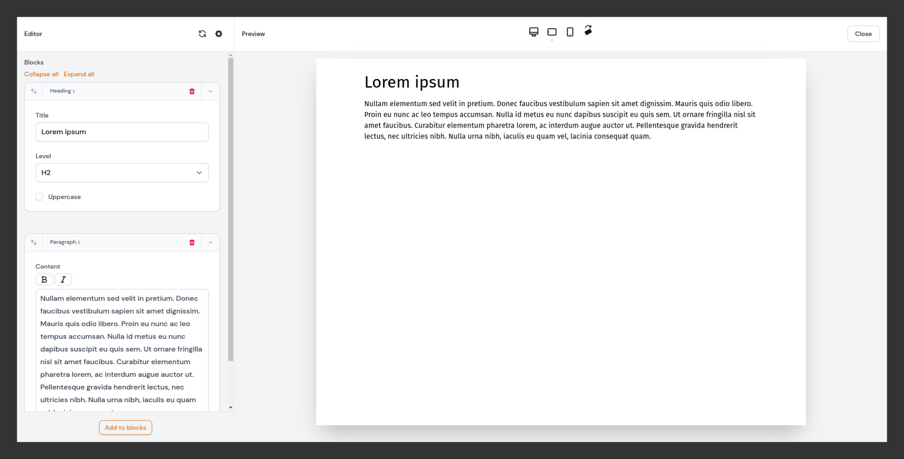

# Builder Previews



## Overview

Clicking the preview link in the form opens a full-screen modal. The modal contains an editor on the left with a copy of the Builder field, and an iframe on the right to render the preview. The iframe can either render a full Blade view or a custom URL.

As you edit the Builder blocks, the preview can be refreshed manually or automatically (auto-refresh is considered experimental for the moment). When the modal is closed, the Builder field in the main form is synchronized with the changes from the preview editor.

Closing the preview modal does not update the record in the database, only the form state is updated.

**Note**: This feature was initially designed with a focus on the Builder field but can be used with any other field type. Make sure to check out the [`Using Custom Fields`](#using-custom-fields) section below.

## Using the Builder Preview with Blade Views

#### Update the Edit Page Class

In your `Edit` page, add both `HasPreviewModal` and `HasBuilderPreview` traits:

```php
use Pboivin\FilamentPeek\Pages\Concerns\HasBuilderPreview;
use Pboivin\FilamentPeek\Pages\Concerns\HasPreviewModal;

class EditPage extends EditRecord
{
    use HasPreviewModal;
    use HasBuilderPreview;

    // ...
```

Add the `getBuilderPreviewView()` method to define your Blade view:

```php
protected function getBuilderPreviewView(string $builderName): ?string
{
    // This corresponds to resources/views/pages/preview-blocks.blade.php
    return 'pages.preview-blocks';
}
```

Then, add the `getBuilderEditorSchema()` method to define your Builder field:

```php
public static function getBuilderEditorSchema(string $builderName): Component|array
{
    return Builder::make('page_blocks')->blocks([
            // ...
    ]);
}
```

To reduce duplication, the Builder field definition can also be extracted to a static method on the resource class (see Complete Example below).

#### Update the Resource Class

Add the `PreviewLink` component to your form, above or below the Builder field:

```php
use Pboivin\FilamentPeek\Forms\Components\PreviewLink;

PreviewLink::make()
    ->label('Preview Page Blocks')
    ->builderPreview('page_blocks'),
```

#### Complete Example

**`app/Filament/Resources/PageResource/Pages/EditPage.php`**

```php
namespace App\Filament\Resources\PageResource\Pages;

use App\Filament\Resources\PageResource;
use Filament\Forms\Components\Component;
use Filament\Resources\Pages\EditRecord;
use Pboivin\FilamentPeek\Pages\Concerns\HasBuilderPreview;
use Pboivin\FilamentPeek\Pages\Concerns\HasPreviewModal;

class EditPage extends EditRecord
{
    use HasPreviewModal;
    use HasBuilderPreview;

    protected static string $resource = PageResource::class;

    protected function getBuilderPreviewView(string $builderName): ?string
    {
        return 'pages.preview-blocks';
    }

    public static function getBuilderEditorSchema(string $builderName): Component|array
    {
        return PageResource::builderField(context: 'preview');
    }
}
```

**`app/Filament/Resources/PageResource.php`**

```php
namespace App\Filament\Resources;

// ...
use Pboivin\FilamentPeek\Forms\Components\PreviewLink;

class PageResource extends Resource
{
    // ...

    public static function builderField(string $context = 'form'): Field
    {
        return Builder::make('page_blocks')->blocks([
            Block::make('heading')->schema([
                Grid::make($context === 'preview' ? 1 : 2)->schema([
                    TextInput::make('title'),

                    Select::make('level')->options([
                        'h2' => 'H2',
                        'h3' => 'H3',
                        'h4' => 'H4',
                    ])->default('h2'),

                    Checkbox::make('uppercase')
                        ->columnSpanFull(),
                ]),
            ]),

            Block::make('paragraph')->schema([
                RichEditor::make('content')
                    ->toolbarButtons(['bold', 'italic']),
            ]),
        ])
            ->columnSpanFull()
            ->collapsible();
    }

    public static function form(Form $form): Form
    {
        return $form->schema([
            TextInput::make('title')
                ->columnSpanFull()
                ->required(),

            PreviewLink::make()
                ->label('Preview Page Blocks')
                ->builderPreview('page_blocks')
                ->columnSpanFull()
                ->alignRight(),

            self::builderField(),
        ]);
    }

    // ...
}
```

**Notes**

 - Builder previews can also be used on `Create` pages.
 - If you're using custom event listeners on your Page class, make sure to also include the `updateBuilderFieldWithEditorData` listener.


## Using Multiple Builder Fields

Most methods in the `HasBuilderPreview` trait receive a `$builderName` argument. This corresponds to the value defined in the preview link's `builderPreview()` method. Therefore, it's possible to support independent previews for multiple Builder fields in the same page:

```php
protected function getBuilderPreviewView(string $builderName): ?string
{
    return match ($builderName) {
        'page_blocks' => 'pages.preview-blocks',
        'footer_blocks' => 'pages.preview-footer-blocks',
    };
}

public static function getBuilderEditorSchema(string $builderName): Component|array
{
    return match ($builderName) {
        'page_blocks' => PageResource::builderField(context: 'preview'),
        'footer_blocks' => PageResource::footerBuilderField(context: 'preview'),
    };
}
```

## Using Custom Fields

You may have noticed that `getBuilderEditorSchema()` supports any type of form Component. Behind the scenes, the Editor sidebar of the preview modal is a full Filament form. Therefore, you are not restricted to using a Builder field, you may use any other field type:

```php
public static function getBuilderEditorSchema(string $builderName): Component|array
{
    return RichEditor::make('page_content');
}
```

Using a single field should work without any other modifications. To support multiple fields in the sidebar, consider using a `Group` component with a custom state path:

```php
public static function getBuilderEditorSchema(string $builderName): Component|array
{
    return Group::make([
        TextInput::make('title'),

        TextInput::make('tagline'),

        RichEditor::make('paragraph'),

        // ...
    ])->statePath('page_content');
}
```

## Adding Extra Data to the Builder Editor State

When the Builder preview modal opens, the Editor sidebar is initialized with the Builder data from the main form. Use the `mutateInitialBuilderEditorData()` method to interact with the data once, before opening the preview modal:

```php
public function mutateInitialBuilderEditorData(string $builderName, array $editorData): array
{
    $editorData['preview_started_at'] = now();

    return $editorData;
}
```

## Adding Extra Data to the Builder Preview

Let's say that your Builder field is named `content`. By default, a `$content` variable is made available to the rendered Blade view. Use the `mutateBuilderPreviewData()` method to interact with the Builder preview data each time, before the preview is refreshed:

```php
public static function mutateBuilderPreviewData(string $builderName, array $editorData, array $previewData): array
{
    $previewData['message'] = "This is a preview. It started at {$editorData['preview_started_at']}.";

    return $previewData;
}
```

This would make a `$message` variable available to the Blade view when rendered in the iframe.

## Alternate Templating Engines

If you're not using Blade views on the front-end, override the `renderBuilderPreview()` method and render the preview with your solution of choice:

```php
public static function renderBuilderPreview(string $view, array $data): string
{
    return MyTemplateEngine::render($view, $data);
}
```

## Using a Preview URL

As with full page previews, you may implement Builder previews using a custom URL and a storage driver, such as the Laravel Cache or the PHP session. Instead of `getBuilderPreviewView()`, use the `getBuilderPreviewUrl()` method to define the preview URL and `mutateBuilderPreviewData()` to temporarily store the preview data:

```php
protected function getBuilderPreviewUrl(string $builderName): ?string
{
    $token = 'page-blocks';

    return route('pages.blocksPreview', ['token' => $token]);
}

public static function mutateBuilderPreviewData(string $builderName, array $editorData, array $previewData): array
{
    $token = 'page-blocks';

    $sessionKey = "preview-$token";

    session()->put($sessionKey, $previewData);

    return $data;
}
```

See also: [Using a Preview URL for Pages](./page-previews.md#using-a-preview-url)

## Customizing the Preview Link

By default, the preview link is styled as a primary link. Use the `button()` method to style it as a Filament button.

Use one of the following methods to adjust the horizontal alignment:

- `alignLeft()`
- `alignCenter()`
- `alignRight()`

Use the `extraAttributes()` method to add any other HTML attributes.

## Automatically Updating the Builder Preview (Experimental)

By default, the Builder Editor is not reactive. Updating the fields won't automatically refresh the preview iframe. You can enable the `showAutoRefreshToggle` in the [configuration](./configuration.md). This will add a checkbox in the header of the Editor panel in the preview modal. Activating this checkbox will make all fields in the Editor behave as `lazy()`. The preview modal will be refreshed automatically each time the focus is taken out of a field (e.g. pressing the `Tab` key or clicking away).

**Note**: Options marked as experimental may break in future releases.

---

**Documentation**

- [Configuration](./configuration.md)
- [Page Previews](./page-previews.md)
- [Builder Previews](./builder-previews.md)
