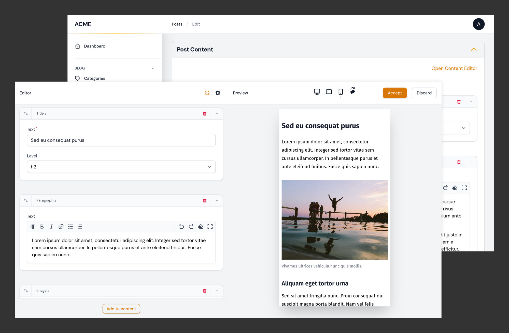
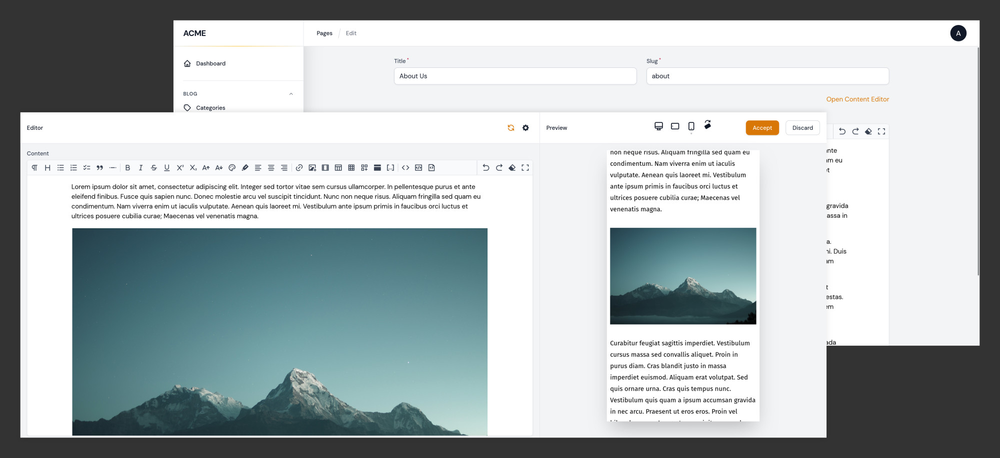

# Builder Previews



## Overview

Clicking the preview link in the form opens a full-screen modal. The modal contains an editor on the left with a copy of the [Builder field](https://filamentphp.com/docs/3.x/forms/fields/builder), and an iframe on the right to render the preview.

As you edit the Builder blocks, the preview can be refreshed manually or automatically. When the modal is closed, the Builder field in the main form is synchronized with the changes from the preview editor.

Closing the preview modal does not update the record in the database, only the form state is updated.

## Using Builder Previews on Edit pages

#### Update the Edit Page Class

In your `Edit` page, add both `HasPreviewModal` and `HasBuilderPreview` traits:

```php
use Pboivin\FilamentPeek\Pages\Concerns\HasPreviewModal;
use Pboivin\FilamentPeek\Pages\Concerns\HasBuilderPreview;

class EditPost extends EditRecord
{
    use HasPreviewModal;
    use HasBuilderPreview;

    // ...
```

Add the `getBuilderPreviewView()` method to define your Blade view:

```php
protected function getBuilderPreviewView(string $builderName): ?string
{
    // This corresponds to resources/views/posts/preview-blocks.blade.php
    return 'posts.preview-blocks';
}
```

Then, add the `getBuilderEditorSchema()` method to define your Builder field:

```php
use Filament\Forms\Components\Component;
use Filament\Forms\Components\Builder;

public static function getBuilderEditorSchema(string $builderName): Component|array
{
    return Builder::make('content_blocks')->blocks([
        // ...
    ]);
}
```

To reduce duplication, the Builder field definition can also be extracted to a static method on the resource class (see [Complete Example](#complete-example) below).

#### Update the Resource Class

Add the `InlinePreviewAction` action to your form, above or below the Builder field:

```php
use Filament\Forms\Components\Actions;
use Pboivin\FilamentPeek\Forms\Actions\InlinePreviewAction;

Actions::make([
    InlinePreviewAction::make()
        ->label('Preview Content Blocks')
        ->builderName('content_blocks'),
]),
```

#### Complete Example

**`app/Filament/Resources/PostResource/Pages/EditPost.php`**

```php
namespace App\Filament\Resources\PostResource\Pages;

use App\Filament\Resources\PostResource;
use Filament\Forms\Components\Component;
use Filament\Resources\Pages\EditRecord;
use Pboivin\FilamentPeek\Pages\Concerns\HasBuilderPreview;
use Pboivin\FilamentPeek\Pages\Concerns\HasPreviewModal;

class EditPost extends EditRecord
{
    use HasPreviewModal;
    use HasBuilderPreview;

    protected static string $resource = PostResource::class;

    protected function getBuilderPreviewView(string $builderName): ?string
    {
        return 'posts.preview-blocks';
    }

    public static function getBuilderEditorSchema(string $builderName): Component|array
    {
        return PostResource::contentBuilderField(context: 'preview');
    }
}
```

**`app/Filament/Resources/PostResource.php`**

```php
namespace App\Filament\Resources;

use Filament\Forms\Components\Actions;
use Filament\Forms\Components\Builder;
use Filament\Forms\Components\Checkbox;
use Filament\Forms\Components\Grid;
use Filament\Forms\Components\RichEditor;
use Filament\Forms\Components\Select;
use Filament\Forms\Components\TextInput;
use Pboivin\FilamentPeek\Forms\Actions\InlinePreviewAction;
// ...

class PostResource extends Resource
{
    // ...

    public static function contentBuilderField(string $context = 'form'): Builder
    {
        return Builder::make('content_blocks')->blocks([
            Builder\Block::make('heading')->schema([
                Grid::make($context === 'preview' ? 1 : 2)->schema([
                    TextInput::make('title'),

                    Select::make('level')->options([
                        'h2' => 'H2',
                        'h3' => 'H3',
                        'h4' => 'H4',
                    ])->default('h2'),

                    Checkbox::make('uppercase')
                        ->columnSpanFull(),
                ]),
            ]),

            Builder\Block::make('paragraph')->schema([
                RichEditor::make('content')
                    ->toolbarButtons(['bold', 'italic']),
            ]),
        ])
            ->columnSpanFull()
            ->collapsible();
    }

    public static function form(Form $form): Form
    {
        return $form->schema([
            TextInput::make('title')
                ->columnSpanFull()
                ->required(),

            Actions::make([
                InlinePreviewAction::make()
                    ->label('Preview Content Blocks')
                    ->builderName('content_blocks'),
            ])
                ->columnSpanFull()
                ->alignEnd(),

            self::contentBuilderField(),
        ]);
    }

    // ...
}
```

#### Demo Project

For an easy way to try out the plugin on a simple Filament project, have a look at the [filament-peek-demo](https://github.com/pboivin/filament-peek-demo/tree/2.x) repository.

## Using Multiple Builder Fields

Most methods in the `HasBuilderPreview` trait receive a `$builderName` argument. This corresponds to the value defined in the preview action's `builderName()` method. Therefore, it's possible to support independent previews for multiple Builder fields in the same form:

```php
protected function getBuilderPreviewView(string $builderName): ?string
{
    return match ($builderName) {
        'content_blocks' => 'posts.preview-content-blocks',
        'footer_blocks' => 'posts.preview-footer-blocks',
    };
}

public static function getBuilderEditorSchema(string $builderName): Component|array
{
    return match ($builderName) {
        'content_blocks' => PostResource::contentBuilderField(context: 'preview'),
        'footer_blocks' => PostResource::footerBuilderField(context: 'preview'),
    };
}
```

## Using Custom Fields



> [Filament Tiptap Editor](https://github.com/awcodes/filament-tiptap-editor) by Adam Weston

You may have noticed that `getBuilderEditorSchema()` supports any type of form Component. Behind the scenes, the Editor sidebar of the preview modal is a full Filament form. Therefore, you are not restricted to using a Builder field, you may use any other field type:

```php
use FilamentTiptapEditor\TiptapEditor;

public static function getBuilderEditorSchema(string $builderName): Component|array
{
    return TiptapEditor::make('post_content');
}
```

Using a single field should work without any other modifications. To support multiple fields in the sidebar, consider using a `Group` component with a custom state path:

```php
public static function getBuilderEditorSchema(string $builderName): Component|array
{
    return Group::make([
        TextInput::make('title'),

        TextInput::make('tagline'),

        TiptapEditor::make('body'),

        // ...
    ])->statePath('post_content');
}
```

#### Compatibility

This feature was initially designed with a focus on the [Builder field](https://filamentphp.com/docs/3.x/forms/fields/builder), using Blocks composed of [built-in Filament fields](https://filamentphp.com/docs/3.x/forms/fields/getting-started#available-fields). It's possible to integrate with custom field types and 3rd party plugins but obviously, not all combinations have been tested.

Please feel free to report any issues you encounter with custom fields [in this repository](https://github.com/pboivin/filament-peek/issues). I can work with you to determine where the issue is coming from.

## Customizing the Preview Action

By default, the action is styled as a primary link. Use the `button()` method to style it as a Filament button.

Use one of the following methods on the `Actions` wrapper to adjust the horizontal alignment:

- `alignStart()`
- `alignCenter()`
- `alignEnd()`
- `alignJustify()`

<a name="preview-auto-refresh"></a>

## Automatically Updating the Builder Preview

By default, the Editor sidebar is not reactive: updating the fields won't automatically refresh the preview iframe. Use the `canEnableAutoRefresh` option in the [configuration](./configuration.md) to add a checkbox in the header of the sidebar. The checkbox lets users opt into the auto-refresh behavior.

Additionally, you may choose between two auto-refresh strategies with the `autoRefreshStrategy` option:

| Name | Description |
|---|---|
| `simple` | The default strategy, which makes all fields in the sidebar behave as `lazy()`, without any other configuration. The preview modal is refreshed automatically each time the focus is taken out of a field (e.g. pressing the `Tab` key or clicking away). Because the preview iframe renders a full Blade view, this is a good compromise between user experience and performance. |
| `reactive` | The alternative strategy, which lets you make fields `lazy()` or `reactive()` as needed. Any field not explicitly configured as lazy or reactive will not trigger a refresh. |

**Important**: Making all fields reactive will have a significant performance penalty and add unnecessary strain on your Web server. Consider using `debounce()` in addition to `reactive()` on your form fields.

## Adding Extra Data to the Builder Editor State

When the Builder preview modal opens, the Editor sidebar is initialized with the Builder data from the main form. Use the `mutateInitialBuilderEditorData()` method to interact with the data once, before opening the preview modal:

```php
public function mutateInitialBuilderEditorData(string $builderName, array $editorData): array
{
    $editorData['preview_started_at'] = now();

    return $editorData;
}
```

## Adding Extra Data to the Builder Preview

Let's say that your Builder field is named `content`. By default, a `$content` variable is made available to the rendered Blade view. Use the `mutateBuilderPreviewData()` method to interact with the Builder preview data each time, before the preview is refreshed:

```php
public static function mutateBuilderPreviewData(string $builderName, array $editorData, array $previewData): array
{
    $previewData['message'] = "This is a preview. It started at {$editorData['preview_started_at']}.";

    return $previewData;
}
```

This would make a `$message` variable available to the Blade view when rendered in the iframe.

## Alternate Templating Engines

If you're not using Blade views on the front-end, override the `renderBuilderPreview()` method and render the preview with your solution of choice:

```php
public static function renderBuilderPreview(string $view, array $data): string
{
    return MyTemplateEngine::render($view, $data);
}
```

---

**Documentation**

<!-- BEGIN_TOC -->

- [Configuration](./configuration.md)
- [Page Previews](./page-previews.md)
- [Builder Previews](./builder-previews.md)
- [JavaScript Hooks](./javascript-hooks.md)
- [Upgrading from v1.x](./upgrade-guide.md)

<!-- END_TOC -->
