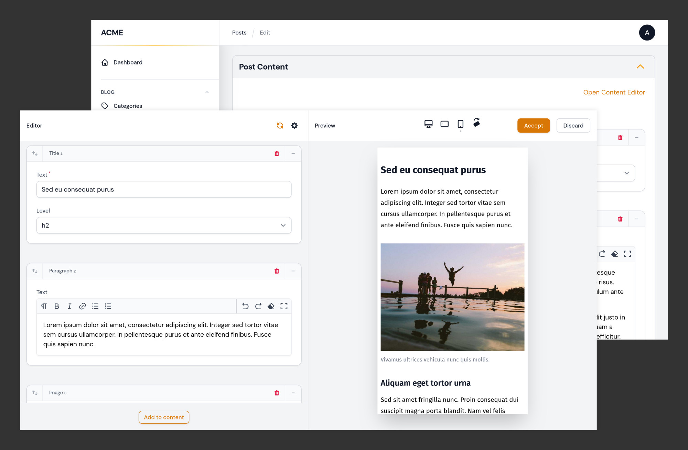

# Builder Previews (deprecated)

> [!WARNING]
> This feature is now deprecated. It will be maintained for the duration of Peek 4.x, but will receive no further development. Some alternatives in Filament core: [Builder Block Previews](https://filamentphp.com/docs/4.x/forms/builder#previewing-blocks) and [Rich Editor Custom Blocks](https://filamentphp.com/docs/4.x/forms/rich-editor#using-custom-blocks).



## Overview

Clicking the preview link in the form opens a full-screen modal. The modal contains an editor on the left with a copy of the [Builder field](https://filamentphp.com/docs/4.x/forms/builder), and an iframe on the right to render the preview.

As you edit the Builder blocks, the preview can be refreshed manually or automatically. When the modal is closed, the Builder field in the main form is synchronized with the changes from the preview editor.

Closing the preview modal does not update the record in the database, only the form state is updated.

## Using Builder Previews on Edit pages

#### Update the Edit Page Class

In your `Edit` page, add both `HasPreviewModal` and `HasBuilderPreview` traits:

```php
use Pboivin\FilamentPeek\Pages\Concerns\HasPreviewModal;
use Pboivin\FilamentPeek\Pages\Concerns\HasBuilderPreview;

class EditPost extends EditRecord
{
    use HasPreviewModal;
    use HasBuilderPreview;

    // ...
```

Add the `getBuilderPreviewView()` method to define your Blade view:

```php
protected function getBuilderPreviewView(string $builderName): ?string
{
    // This corresponds to resources/views/posts/preview-blocks.blade.php
    return 'posts.preview-blocks';
}
```

Then, add the `getBuilderEditorSchema()` method to define your Builder field:

```php
use Filament\Schemas\Components\Component;
use Filament\Forms\Components\Builder;

public static function getBuilderEditorSchema(string $builderName): Component|array
{
    return Builder::make('content_blocks')->blocks([
        // ...
    ]);
}
```

To reduce duplication, the Builder field definition can also be extracted to a static method on the resource class (see [Complete Example](#complete-example) below).

#### Update the Resource Class

Add the `InlinePreviewAction` action to your form, above or below the Builder field:

```php
use Filament\Schemas\Components\Actions;
use Pboivin\FilamentPeek\Forms\Actions\InlinePreviewAction;

Actions::make([
    InlinePreviewAction::make()
        ->label('Preview Content Blocks')
        ->builderName('content_blocks'),
]),
```

#### Complete Example

**`app/Filament/Resources/PostResource/Pages/EditPost.php`**

```php
namespace App\Filament\Resources\PostResource\Pages;

use App\Filament\Resources\PostResource;
use Filament\Schemas\Components\Component;
use Filament\Resources\Pages\EditRecord;
use Pboivin\FilamentPeek\Pages\Concerns\HasBuilderPreview;
use Pboivin\FilamentPeek\Pages\Concerns\HasPreviewModal;

class EditPost extends EditRecord
{
    use HasPreviewModal;
    use HasBuilderPreview;

    protected static string $resource = PostResource::class;

    protected function getBuilderPreviewView(string $builderName): ?string
    {
        return 'posts.preview-blocks';
    }

    public static function getBuilderEditorSchema(string $builderName): Component|array
    {
        return PostResource::contentBuilderField(context: 'preview');
    }
}
```

**`app/Filament/Resources/PostResource.php`**

```php
namespace App\Filament\Resources;

use Filament\Forms\Components\Builder;
use Filament\Forms\Components\Checkbox;
use Filament\Forms\Components\Grid;
use Filament\Forms\Components\RichEditor;
use Filament\Forms\Components\Select;
use Filament\Forms\Components\TextInput;
use Filament\Schemas\Components\Actions;
use Pboivin\FilamentPeek\Forms\Actions\InlinePreviewAction;
// ...

class PostResource extends Resource
{
    // ...

    public static function contentBuilderField(string $context = 'form'): Builder
    {
        return Builder::make('content_blocks')->blocks([
            Builder\Block::make('heading')->schema([
                Grid::make($context === 'preview' ? 1 : 2)->schema([
                    TextInput::make('title'),

                    Select::make('level')->options([
                        'h2' => 'H2',
                        'h3' => 'H3',
                        'h4' => 'H4',
                    ])->default('h2'),

                    Checkbox::make('uppercase')
                        ->columnSpanFull(),
                ]),
            ]),

            Builder\Block::make('paragraph')->schema([
                RichEditor::make('content')
                    ->toolbarButtons(['bold', 'italic']),
            ]),
        ])
            ->columnSpanFull()
            ->collapsible();
    }

    public static function form(Schema $schema): Schema
    {
        return $schema->components([
            TextInput::make('title')
                ->columnSpanFull()
                ->required(),

            Actions::make([
                InlinePreviewAction::make()
                    ->label('Preview Content Blocks')
                    ->builderName('content_blocks'),
            ])
                ->columnSpanFull()
                ->alignEnd(),

            self::contentBuilderField(),
        ]);
    }

    // ...
}
```

## Compatibility

This feature was initially designed with a focus on the [Builder field](https://filamentphp.com/docs/4.x/forms/builder), using Blocks composed of built-in Filament fields. It's possible to integrate with custom field types and 3rd party plugins but obviously, not all combinations have been tested.

## Customizing the Preview Action

By default, the action is styled as a primary link. Use the `button()` method to style it as a Filament button.

Use one of the following methods on the `Actions` wrapper to adjust the horizontal alignment:

- `alignStart()`
- `alignCenter()`
- `alignEnd()`
- `alignJustify()`

<a name="preview-auto-refresh"></a>

## Adding Extra Data to the Builder Editor State

When the Builder preview modal opens, the Editor sidebar is initialized with the Builder data from the main form. Use the `mutateInitialBuilderEditorData()` method to interact with the data once, before opening the preview modal:

```php
public function mutateInitialBuilderEditorData(string $builderName, array $editorData): array
{
    $editorData['preview_started_at'] = now();

    return $editorData;
}
```

## Adding Extra Data to the Builder Preview

Let's say that your Builder field is named `content`. By default, a `$content` variable is made available to the rendered Blade view. Use the `mutateBuilderPreviewData()` method to interact with the Builder preview data each time, before the preview is refreshed:

```php
public static function mutateBuilderPreviewData(string $builderName, array $editorData, array $previewData): array
{
    $previewData['message'] = "This is a preview. It started at {$editorData['preview_started_at']}.";

    return $previewData;
}
```

This would make a `$message` variable available to the Blade view when rendered in the iframe.

## Alternate Templating Engines

If you're not using Blade views on the front-end, override the `renderBuilderPreview()` method and render the preview with your solution of choice:

```php
public static function renderBuilderPreview(string $view, array $data): string
{
    return MyTemplateEngine::render($view, $data);
}
```

---

**Documentation**

<!-- BEGIN_TOC -->

- [Configuration](./configuration.md)
- [Page Previews](./page-previews.md)
- [Builder Previews (deprecated)](./builder-previews.md)
- [JavaScript Hooks](./javascript-hooks.md)
- [Upgrading from Peek 2.x](./upgrade-guide.md)

<!-- END_TOC -->
