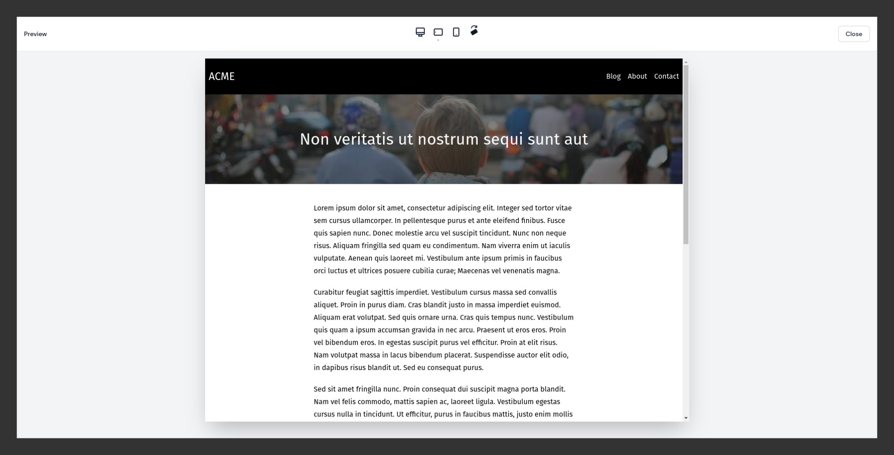

# Page Previews



## Overview

- A preview action button at the top of the page opens a full-screen modal.
- The modal contains an iframe that can be resized according to some configured presets.
- The iframe can either render a full Blade view or a custom URL.
- The preview action does not update the record in the database, the form state is unchanged.

## Using the Preview Modal with Blade Views

In your `EditRecord` page:

- Add the `HasPreviewModal` trait.
- Add the `PreviewAction` class to the returned array in `getActions()`.
- Override the `getPreviewModalView()` method to define your Blade view.
- If your view expects a `$page` variable, override the `getPreviewModalDataRecordKey()` method to define it. By default, this variable will be `$record`.

**Note**: Page previews can also be used on `CreateRecord` and `ListRecords` pages.

#### Complete Example

`app/Filament/Resources/PageResource/Pages/EditPage.php`

```php
namespace App\Filament\Resources\PageResource\Pages;

use App\Filament\Resources\PageResource;
use Filament\Resources\Pages\EditRecord;
use Pboivin\FilamentPeek\Pages\Actions\PreviewAction;
use Pboivin\FilamentPeek\Pages\Concerns\HasPreviewModal;

class EditPage extends EditRecord
{
    use HasPreviewModal;

    protected static string $resource = PageResource::class;

    protected function getActions(): array
    {
        return [
            PreviewAction::make(),
        ];
    }

    protected function getPreviewModalView(): ?string
    {
        return 'pages.preview';
    }

    protected function getPreviewModalDataRecordKey(): ?string
    {
        return 'page';
    }
}
```

## Detecting the Preview Modal

If you're using the same Blade view for the site page and the preview modal, you can detect if the view is currently rendered in a preview modal by checking for the `$isPeekPreviewModal` variable:

`resources/views/pages/show.blade.php`

```blade
<x-layout>
    @isset($isPeekPreviewModal)
        <x-preview-banner />
    @endisset
    
    <x-container>
        ...
    </x-container>
</x-layout>
```

## Adding Extra Data to Previews

By default, the `$record` and `$isPeekPreviewModal` variables are made available to the rendered Blade view. If your form is relatively simple and all fields belong directly to the record, this may be all you need. However, if you have complex relationships or heavily customized form fields, you may need to include some additional data in order to render your page preview. You can add other variables by overriding the `mutatePreviewModalData()` method:

```php
class EditPage extends EditRecord
{
    // ...
    
    protected function mutatePreviewModalData(array $data): array
    {
        $data['message'] = 'This is a preview';

        return $data;
    }
}
```

This would make a `$message` variable available to the Blade view when rendered in the iframe.

Inside of `mutatePreviewModalData()` you can access:
- the modified record with unsaved changes: `$data['record']`
- the original record: `$this->record`
- any other data from the form: `$this->data['my_custom_field']`

## Dynamically Setting the View

If needed, you can use the `previewModalData` property to dynamically set the modal view:

```php
class EditPage extends EditRecord
{
    // ...
    
    protected function getPreviewModalView(): ?string
    {
        return $this->previewModalData['record']->is_featured ? 
            'posts.featured' :
            'posts.show';
    }
}
```

## Alternate Templating Engines

If you're not using Blade views on the front-end, override the `renderPreviewModalView()` method and render the preview with your solution of choice:

```php
    protected function renderPreviewModalView($view, $data): string
    {
        return MyTemplateEngine::render($view, $data);
    }
```

## Using a Preview URL

Instead of rendering a view, you may implement page previews using a custom URL and the PHP session (or cache). Instead of `getPreviewModalView()`, override the `getPreviewModalUrl()` method to return the preview URL:

```php
class EditPage extends EditRecord
{
    // ...
    
    protected function getPreviewModalUrl(): ?string
    {
        $token = uniqid();

        $sessionKey = "preview-$token";

        session()->put($sessionKey, $this->previewModalData);

        return route('pages.preview', ['token' => $token]);
    }
}
```

Then, you can fetch the preview data from the controller through the session (or cache):

```php
class PageController extends Controller
{
    // ...

    public function preview($token)
    {
        $previewData = session("preview-$token");

        abort_if(is_null($previewData), 404);
        
        // ...
    }
}
```

This technique can also be used to implement page previews with a decoupled front-end (e.g. Next.js):

- From `getPreviewModalUrl()`, generate the preview token and return a front-end preview URL.
- Then from the front-end page component, fetch the preview data from the back-end preview URL.

## Embedding a Preview Link into the Form

Instead of `PreviewAction`, you can use the `PreviewLink` component to integrate the Preview button directly in your form (e.g. in a sidebar):

```php 
use Pboivin\FilamentPeek\Forms\Components\PreviewLink;

class PageResource extends Resource
{
    // ...

    public static function form(Form $form): Form
    {
        return $form->schema([
            // ...

            PreviewLink::make(),
        ]);
    }
}
```

By default, the preview link is styled as an underlined link. Use the `button()` method to style it as a Filament button.

Use one of the following methods to adjust the horizontal alignment:

- `alignLeft()`
- `alignCenter()`
- `alignRight()`

Use the `extraAttributes()` method to add any extra HTML attributes.

## Preview Pointer Events

By default, only scrolling is allowed in the preview iframe. This is done by inserting a very small `<style>` tag at the end of your preview's `<body>`. If this doesn't work for your use-case, you can enable all pointer events with the [`allowIframePointerEvents` option](./configuration.md).

If you need finer control over pointer events in your previews, first set this option to `true` in the configuration. Then, in your page template, add the required CSS or JS. Here's an exemple disabling preview pointer events only for `<a>` tags:

`resources/views/pages/show.blade.php`

```blade
...

@isset($isPeekPreviewModal)
    <style>
        a { pointer-events: none !important; }
    </style>
@endisset
```

---

**Contents**

- [Configuration](./configuration.md)
- [Page Previews](./page-previews.md)
- [Builder Field Previews](./builder-field-previews.md)
